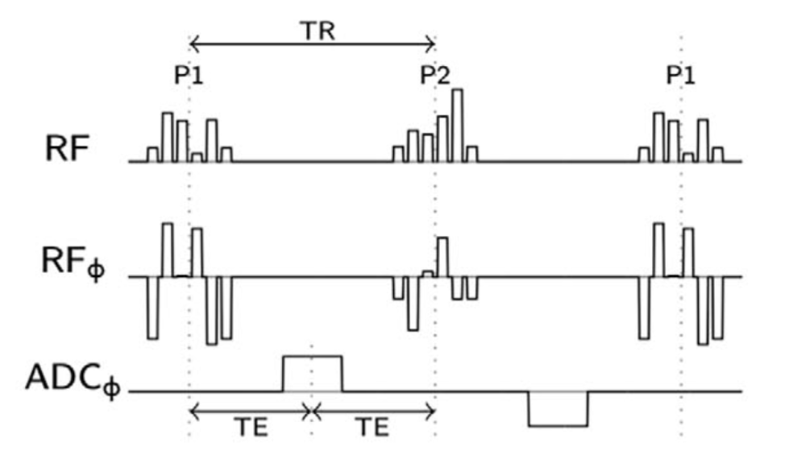
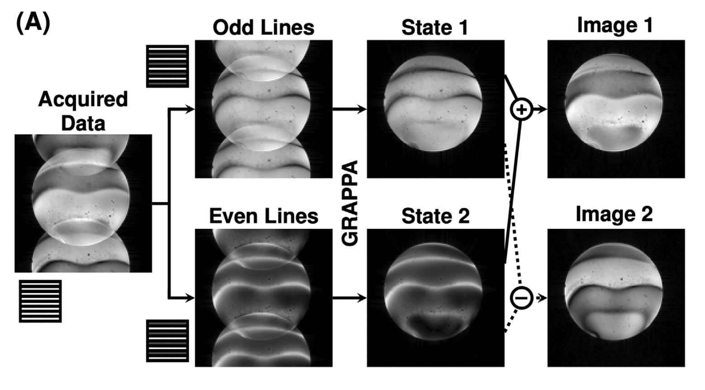
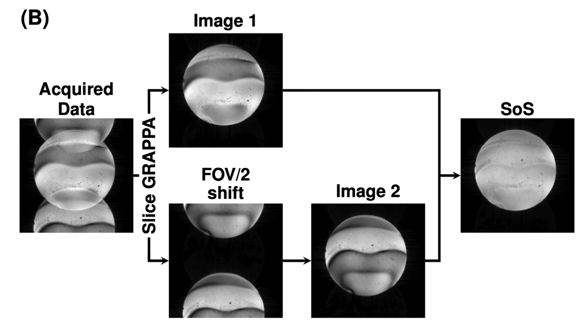
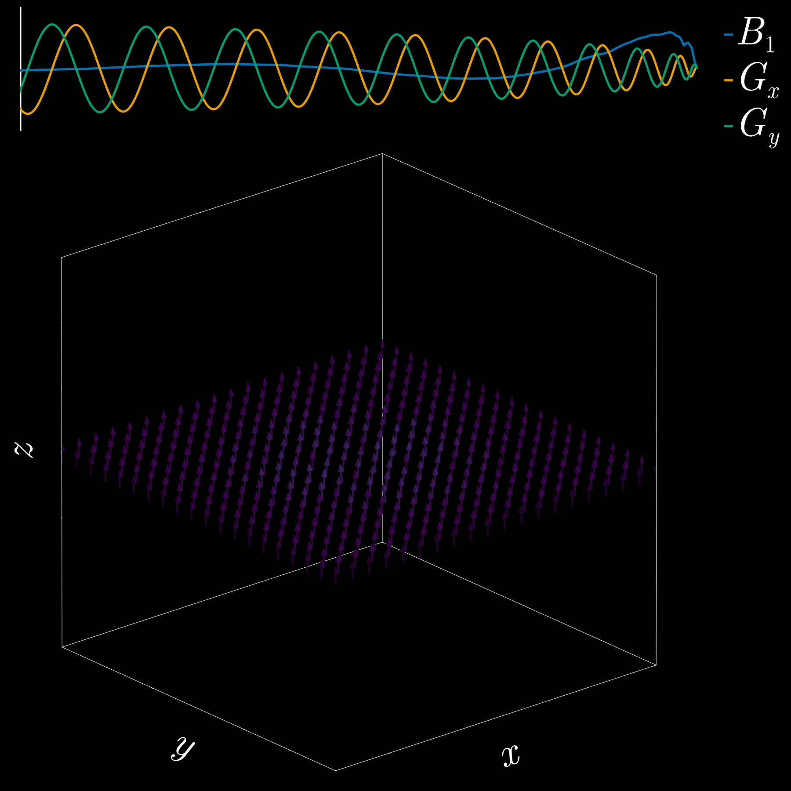

```{julia}
using Pkg
Pkg.activate("../")
Pkg.instantiate()

using KomaMRI, CUDA, MAT, PlotlyJS
using KomaMRI.MRIReco.FFTW, KomaMRI.KomaMRIBase

utils_path = "/home/export/personal/pvilayl/KomaOpt/utils/"

include(utils_path * "disk_phantom.jl")
include(utils_path * "direct_reconstruction.jl")
include(utils_path * "plots_utils.jl")
```

## Introduction {data-background-image="images/background.png"}

Current methods for reducing banding artifacts in bSSFP use multiple-acquisition-based approaches, which require long acquisition times and are prone to motion artifacts. 

### Reference work

The work from @wu_mitigating_2026 uses pTx (kT-points) to mitigate both B1+ and B0 inhomogeneities.

They spatially define both the phase and amplitude of 2 excitation pulses (**P1** and **P2**) within a region of interest (ROI).

Regarding B1+ inhomogeneities, they enforce the flip-angles of **P1** and **P2** to remain constant throughout the ROI (@fig-rf-design).

Regarding B0 inhomogeneities, having previously calculated the B0 map, they enforce the phases of **P1** and **P2** to produce a phase difference $\Delta\phi$ of $-\gamma\Delta B_0 TR$ in each pixel (@fig-rf-design).

**P1/P2 pulse duration is in the order of 2-3 ms.**

{#fig-rf-design}

When applying alternatively these two pulses within a bSSFP sequence (@fig-sequence), the acquired data can be separated into two different states depending on the specific TR where the signal is read.

{#fig-sequence}

The two states are initially mixed within the same image, but can be separated using two different techniques:

- Odd/Even separation + GRAPPA reconstruction (@fig-odd-even-grappa):

{#fig-odd-even-grappa}

- Slice-GRAPPA (@fig-slice-grappa):

{#fig-slice-grappa}

By performing a Sum of Squares (SoS) over the obtained images, one can obtain a final image with reduced banding artifacts.

## Single Tx channel approach: optimized 2D SSE RF pulses



By using this approach, we can not only define the magnitude (module) of the magnetization produced by the RF pulse over a ROI, but also its phase. This would allow us to mimic the effect of the pTx pulses used in @wu_mitigating_2026, but using a single Tx channel.

**The main drawback would be the need for longer RF pulses.**

## Methods

### Phantom definition
We define a disk phantom with linear B0 variation along the y direction:

```{julia}
birdcage = BirdcageCoilSens(; ncoils=8);
sys = Scanner(; receiver=birdcage);

Nspins_y = 80
Nspins_x = 80
FOV_sim = 120e-3
R_phantom = FOV_sim * (215 / 512)

Δf_per_m = 150.0f0 / (2 * R_phantom)

T1 = 1000 * 1e-3
T2 = 50 * 1e-3

obj_disk, spin_params, mask_2d, Δf_hz = disk_phantom(Nspins_x, Nspins_y, FOV_sim, R_phantom, Δf_per_m, T1, T2)

plot_phantom_map(obj_disk, :Δw)
```

*2D disk phantom with linear B0 variation along the y direction.*

### RF design and optimization

RF optimization will be performed over this phantom. We want to design 2 RF pulses whose phase difference for all pixels is $\Delta\phi = -\gamma\Delta B_0 TR$.

For TR = 12 ms, FA = 1°, and RF duration approximately 8 ms:


### bSSFP construction 
Since the flip angle of the optimized pulses is 1°, we can scale them to the desired FA just by multiplying theis amplitude by the desired FA / 1°. In this case, we want a FA of 20°.

Then, we include the optimized RF pulses in a bSSFP sequence:
```{julia}
seq_p1_p1 = read_seq(joinpath(@__DIR__, "../sequences/seq_p1_p1.seq"))
seq_p2_p2 = read_seq(joinpath(@__DIR__, "../sequences/seq_p2_p2.seq"))
seq_p1_p2 = read_seq(joinpath(@__DIR__, "../sequences/seq_p1_p2.seq"))
seq_calib = read_seq(joinpath(@__DIR__, "../sequences/seq_calib.seq"))
seq_init  = read_seq(joinpath(@__DIR__, "../sequences/seq_init.seq"))

TR = seq_p1_p2.DEF["TR"]
FA = seq_p1_p2.DEF["FA"]
rf_dur = dur(seq_p1_p2[is_RF_on.(seq_p1_p2)][1]) * 1e3

sim_params = KomaMRICore.default_sim_params()

plot_seq(seq_p1_p2[1201:1223])
```

### Simulations and GRAPPA reconstruction

We use both the disk phantom and the bSSFP sequence to simulate the acquisition of the data.

For reconstruction:

1. we use a GRAPPA reconstruction with a 3x4 kernel to get the two bSSP states
2. we do both a complex summation and complex subtraction of the two states, enabling us to obtain two complementary images,
3. we perform a Sum of Squares (SoS) over the two complementary images to obtain a final image with reduced banding artifacts.

## Results

For different combinations of RF TR/FA/RF duration:

```{julia}
#| output: asis

result_files = sort(
    filter(f -> startswith(basename(f), "result_"), readdir(joinpath(@__DIR__, "images"); join=true));
    by = f -> begin
        m = match(r"^result_TR([0-9]+)_FA([0-9]+)_RFdur([0-9]+)\.", basename(f))
        m === nothing && return (-typemax(Int), -typemax(Int), -typemax(Int))
        tr = parse(Int, m.captures[1])
        fa = parse(Int, m.captures[2])
        rf = parse(Int, m.captures[3])
        return (tr, fa, rf)
    end,
    rev=true,
)

for f in result_files
    name = basename(f)
    m = match(r"^result_TR([0-9]+)_FA([0-9]+)_RFdur([0-9]+)\.", name)
    if m === nothing
        println("))")
    else
        tr, fa, rf = m.captures
        println("))")
    end
    println()
end
```

## Discussion
- In general, the results are good, but the banding artifacts are not completely removed.
- We can see that higher TR and FA generaly lead to better results.
- Regarding RF duration, a longer excitation allows for a better excitation profile, but is more sensitive to B0 inhomogeneities.
- If the RF duration is too short, we will have two issues:
    - The excitation profile will be poor.
    - For a given FA, RF amplitude would need to be higher, leading to a higher SAR.
- But we would want them to be as low as possible to reduce the acquisition time and SAR. Otherwise, this method would not be practical.
- The phantom used for now is very simple; more complex anatomy would require more complex RF pulses and may not give good results (@wu_mitigating_2026).
- Next steps: 
    - Explore other transmit k-space trajectories, optimized for the specific ROI and anatomy. See @geldschlager_otup_2022 for an example of this approach.
    - Explore other reconstruction/image combination techniques.
- The final goal would be to reduce banding artifacts in more complex anatomies, with motion, such as in the heart. The dynamic phantoms of KomaMRI could be used for this purpose.

## References

::: {#refs}
:::